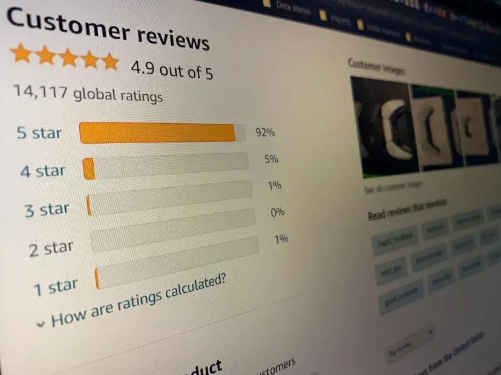
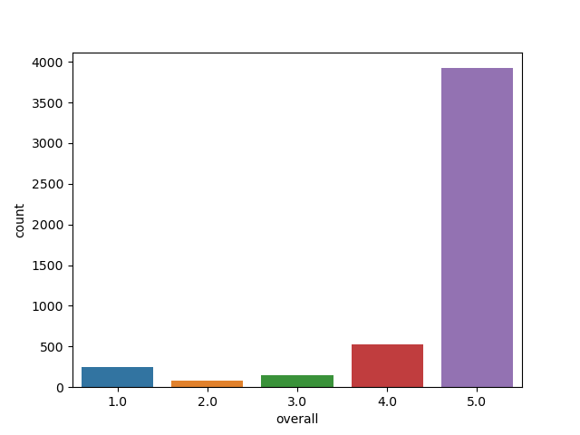
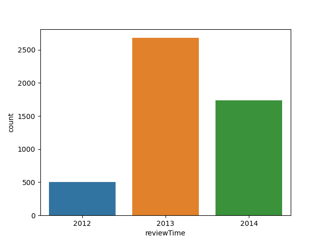
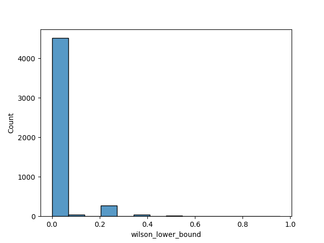

# Rating Product & Sorting Reviews in Amazon

## Business Problem

One of the most important problems in e-commerce is the correct calculation of the points
given to the products after sales. The solution to this problem means providing greater
customer satisfaction for the e-commerce site, prominence of the product for the sellers
and a seamless shopping experience for the buyers. Another problem is the correct ordering
of the comments given to the products. The prominence of misleading comments will cause both
financial loss and loss of customers. In the solution of these 2 basic problems, while the
e-commerce site and the sellers will increase their sales, the customers will complete the
purchasing journey without any problems.

##  Dataset Story:

This dataset containing Amazon Product Data includes product categories and various metadata.
The product with the most comments in the electronics category has user ratings and comments.

## Features:

 Sr. | Feature  | Description |
--- | --- | --- | 
1 | reviewerID | User Id| 
2 | asin | Product Id | 
3 | reviewerName | User Name | 
4 | helpful | Useful Evaluation Degree | 
5 | reviewText | Evaluation |
6 | overall | Product Rating |
7 | summary | Evaluation Summary |
8 | unixReviewTime | Evaluation Time |
9 | reviewTime | Evaluation Time {RAW} |
10 | days - day_diff | Number of days since assessment |
11 | helpful_yes | The number of times the evaluation was found useful |
12 | total_vote | Number of votes given to the evaluation |

* **Total Features :** **12**
* **Total Row :** **4915**
* **CSV File Size :** **71.9MB**

---
### Data Visualization
- product rating distributions

- distribution of product reviews by years

---
#### Wilson Lower Bound Score
The lower limit of the confidence interval to be calculated for the Bernoulli parameter p is accepted as the WLB score.
The score to be calculated is used for product ranking.

